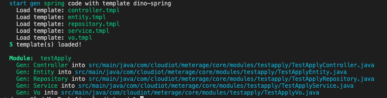

<script setup>
import { VPHomeHero } from 'vitepress/theme'
</script>

<VPHomeHero  style="padding-left:0" />

## 快速开始

安装：
```shell
npm install -g @dino-dev/cli
# OR
yarn global add @dino-dev/cli

# check install
dino --version
# @dino/cli x.x.x
```

代码生成：
```shell
dino code test-apply

# output as follow ↓↓↓
```


